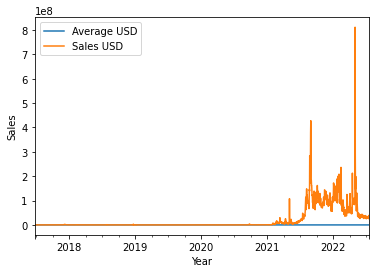

# Low Cost NFT Mint

## ABSTRACT

- https://docs.etherscan.io/
- https://docs.etherscan.io/api-endpoints/gas-tracker
- https://api.etherscan.io/apis
- https://public-api.solscan.io/docs/#/
- https://solanafloor.com/
- https://explorer.solana.com/

## Keywords

## 1. INTRODUCTION

## 2. NFT market overview

Overview figure (market overview, consulting report)

- https://nonfungible.com/market-tracker number of NFT total sales, top sales project
  - 
  - 
  - 
  - 
  - 
  - 
    
  - 
  - 
  - 
- https://dappradar.com/nft top sales market places & collections

### 2.1. NFT terms

Open market

Private market

Gas fee

Mint

Lazy mint

Wallet

### 2.2. NFT blockchains in comparison

Ethereum: ERC 20, ERC 721, ERC 777

Solana:

Flow:

Klayton:

### 2.3. NFT issues

Copyright violation

Double minting

Legal cases:

## 3. Mint

### 3.1. Popularity

Figure: Trade volume (daily?) over time. Ethereum, Solana, Flow, Klayton NFT (in coin and USD) vs. time

- https://www.theblock.co/data/nft-non-fungible-tokens/nft-overview NFT trade volume
  - https://cryptoslam.gitbook.io/docs/developers/cryptoslam-public-api api

Figure: Floor value over time. 

Table: same as above

Compare market size: e.g.) Solana is 1/10 of Ethereum in trading volume

### 3.2. Mint cost

Define minting

Define gas fee

Define market commission

 

Figure: Ethereum mint (gas+) cost over time

- https://raribleanalytics.com/ ethereum all fees

Table: same as above

 

Figure: Solana mint cost over time

- https://www.techdreams.org/crypto-currency/the-solana-gas-fee-trend/12713-20220206 solana gas fee trend (only graph)
- https://solanabeach.io/supply solana gas fee track
  - https://github.com/solana-beach/api track api

Figure: Flow mint cost over time

- https://docs.onflow.org/concepts/variable-transaction-fees/ fee structure

Figure: Klayton mint cost over time

- https://docs.klaytn.foundation/klaytn/design/transaction-fees transaction fee docs
  - The unit price (also called `gas price`) is set in the system by the governance. It is currently set to 250 ston (*i.e.*, 250 x 10^9 peb) per gas and cannot be changed by user. The current value of the unit price can be obtained by calling the `klay.gasPrice` API

Figure: Mint count over time. for all blockchains

It is unpredictable and increasing.

- https://cryptocurrencyalerting.com/rest-api.html mint cost alert api
- https://pandas-xlsxwriter-charts.readthedocs.io/chart_examples.html#axis-labels pandas examples
- https://www.finder.com/nft-glossary terminology (referable?)

### 3.3. Analysis

Figure: Mint cost over time

## 4. Practicals

Mint approaches, tools, app

## 5. Discussion

## 6. REFERENCES

